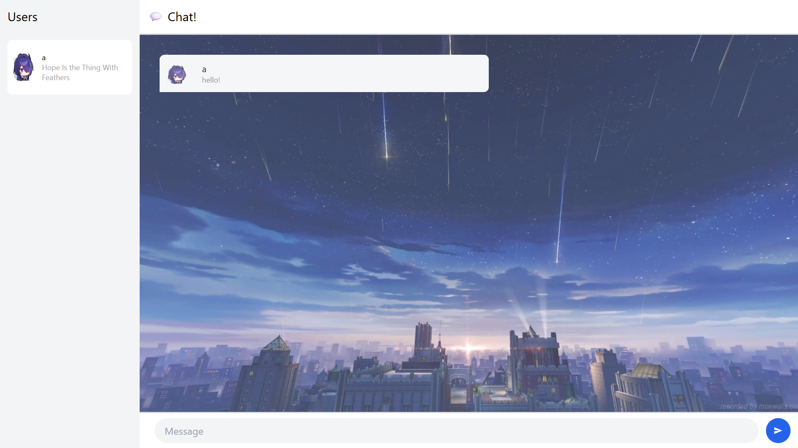

# Tutorial 10
**Nama:**   Joshua Montolalu<br>
**NPM:**    2306275746<br>
**Kelas:**  Pengjut A<br>

## Modul 10
### Experiment 3.1 (Original Code)


### Experiment 3.2 (Creativity)

- Untuk bagian ini, saya menambah *profile picture* yang berbeda, menambah *background image* untuk halaman chat, dan memposisikan *profile picture* di tengah agar lebih rapi.

### Bonus: Change the websocket server!
Berikut adalah perubahan yang saya lakukan pada file [server.rs](broadcast-chat/src/bin/server.rs):
1. Pertama, saya menambah *struct* `User` dan `UserRepository` untuk menyimpan pengguna.
```rs
pub struct User {
    websocket_addr: SocketAddr,
    nickname: String,
    is_online: bool,
}

pub struct UserRepository {
    pub users: Arc<Mutex<Vec<User>>>,
}
```

2. Kemudian, saya mengubah fungsi `handle_connection()` untuk menerima `UserRepository` tersebut sebagai argumen.
```rs
async fn handle_connection(
    addr: SocketAddr,
    mut ws_stream: WebSocketStream<TcpStream>,
    bcast_tx: Sender<String>,
    user_repo: Arc<Mutex<Vec<User>>>,
) -> Result<(), Box<dyn Error + Send + Sync>> {
    // kode lain
}
```

3. Saya menambah beberapa *struct* baru untuk merepresentasikan *request* dan *response* yang perlu di-*serialize* dan di-*deserialize* menggunakan *library* `serde` dan `serde_json` 
```rs
#[derive(Serialize, Deserialize, Debug)]
#[serde(rename_all = "camelCase")]
pub struct MessageData {
    pub message_type: String,
    pub data_array: Option<Vec<String>>,
    pub data: Option<String>,
}

#[derive(Serialize, Deserialize, Debug)]
#[serde(rename_all = "camelCase")]
pub struct ChatMessage {
    pub from: String,
    pub message: String,
}
```

4. Lalu, saya mengubah alur handling untuk menyesuaikan dengan format yang dikirim oleh server JavaScript dan format yang diharapkan oleh client.
    - Saya *deserialize* setiap pesan yang masuk menjadi *instance* `MessageData`
    ```rs
    let msg_data: MessageData = serde_json::from_str(msg.as_text().unwrap_or_default())
        .unwrap();
    ```

    - Saya menambah alur untuk *handle* registrasi pengguna (`messageType` = `'register'`)
    ```rs
    "register" => {
        user_repo.lock().unwrap().push(User {
            websocket_addr: addr,
            nickname: msg_data.data.unwrap_or_default(),
            is_online: true,
        });
        let message = MessageData {
            message_type: String::from("users"),
            data_array: Some(user_repo.lock().unwrap().iter()
                .map(|user| user.nickname.clone())
                .collect()),
            data: None,
        };
        let json = serde_json::to_string(&message)?;
        println!("Broadcasting to all clients: {json:?}");
        bcast_tx.send(json)?;
    }
    ```

    - Kemudian saya menambah alur untuk *handle* pengiriman *chat* (`messageType` = `'message'`)
    ```rs
    "message" => {
        let users = user_repo.lock().unwrap();
        if let Some(sender) = users.iter().find(|user| user.websocket_addr == addr) {
            let message = MessageData {
                message_type: String::from("message"),
                data_array: None,
                data: Some(serde_json::to_string(&ChatMessage {
                    from: sender.nickname.clone(),
                    message: msg_data.data.unwrap_or_default(),
                })?),
            };
            let json = serde_json::to_string(&message)?;
            println!("Broadcasting to all clients: {json:?}");
            bcast_tx.send(json)?;
        }
    }
    ```

Setelah saya mencoba menggunakan *server* ini untuk menggantikan *server* WebSocket JavaScript, ternyata berhasil juga mendaftar pengguna dan mengirim pesan (walaupun belum berhasil melakukan *polling* untuk memeriksa pengguna yang masih *online* dan pengguna yang sudah *disconnect*). Ini bisa terjadi karena *client* tidak peduli bagaimana implementasi *server* WebSocket (dari segi bahasa ataupun detil-detil implementasi lain). Yang penting adalah format *request* dan *response* pada *server* disesuaikan dengan apa yang sudah ada di *client* (apa yang diharapkan oleh *client*).

Menurut saya kedua versi *server* (Rust dan JavaScript) valid-valid saja dan masing-masing dapat digunakan sesuai dengan kebutuhan kita. Jika kita ingin *performance* yang optimal dan cepat + fitur *concurrency*/*multithreading* yang didukung oleh Rust, kita dapat menggunakan versi ini, tetapi jika kita tidak terlalu membutuhkan *performance* dan hanya butuh *server* yang simpel dan mudah/cepat untuk dibuat, versi JavaScript dapat digunakan.
